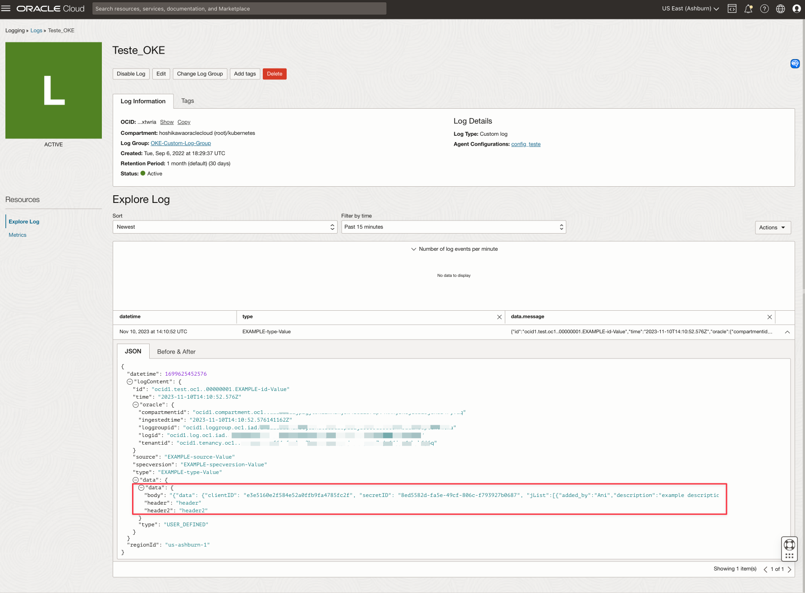

# Learn how to use Oracle Cloud API Gateway, Functions and Observability to validate JSON content and monitor API Headers and Body

## Introduction

When we develop distributed applications, especially in architectures based on microservices, we want components that scale and perform well in their execution.
They are very complex architectures, components that execute other components that execute other components in an infinite number of endless calls. 

Planning how to develop each of them is a huge task.
You can expose your microservices built on a Kubernetes cluster through the OCI API Gateway. There are a series of facilities, such as performing call authentication and authorization, data validation and call optimization, to name just a few.
There is also the possibility of executing calls with OCI Functions with the aim of creating personalized authentication and authorization mechanisms, when existing methods are not sufficient to solve the need.

This material will show how to use the custom mechanism to validate some use cases such as:

- Validate the size of JSON parameter data
- Validate the maximum number of JSON items

Despite being a mechanism for authentication and authorization in the OCI API Gateway, it could help with some other needs, such as:

- Capture data from HEADER, query parameters or the body of the REST call
- Send this data to OCI Observability with the aim of facilitating the debugging of problems, which are often impossible to detect without this information

>**Note:** If you are sending data to Observability, consider in your code, as a best practice, use of redaction for HEADER or BODY content, like passwords or sensitive data. Another approach could be to turn on/off your function for debugging purposes.

### Objectives

- Configure an API Deployment
- Develop an OCI Function to capture the HEADER and BODY from the API request
- Validade a body JSON data
- Send the HEADER and BODY information to OCI Observability 

### Prerequisites

- An operational Oracle Cloud tenant: You can create a free Oracle Cloud account with US$ 300.00 for a month to try this tutorial. See [Create a Free Oracle Cloud Account](https://www.oracle.com/cloud/free/).
- An OCI API Gateway instance created and exposed to the Internet. See [Creating Your First API Gateway In The Oracle Cloud](https://blogs.oracle.com/developers/post/creating-your-first-api-gateway-in-the-oracle-cloud).

## Task 1: Configure OCI Observability

## Task 2: Create an OCI Function to capture the HEADERs and BODY from API request

This [code](./files/function.zip) can do the job of:

- Capture the HEADER and BODY from the API request
- Validade a body JSON data: There is a method for validate a number of items on each array
- Send the HEADER and BODY information to OCI Observability

        import io
        import json
        import logging
        import requests
        import oci

        from fdk import response
        from datetime import timedelta

        def count_items(dictData):
            counting = 0
            for item in dictData:
                if type(dictData[item]) == list:
                    counting += len(dictData[item])
                else:
                    if not type(dictData[item]) == str:
                        counting += count_items(dictData[item])
            return counting

        def handler(ctx, data: io.BytesIO = None):
            jsonData = "API Error"
            c = 0
            try:
                config = oci.config.from_file("./config","DEFAULT")
                logging = oci.loggingingestion.LoggingClient(config)
                rdata = json.dumps({
                    "active": True,
                    "context": {
                        "requestheader": data.getvalue().decode('utf-8'),
                    },
                })

                jsonData = data.getvalue().decode('utf-8')
                # Get the body content from the API request
                body = dict(json.loads(data.getvalue().decode('utf-8')).get("data"))["body"]
                body = dict(json.loads(body))
                # Count the number of items on arrays inside the JSON body
                c = count_items(body)

                # If JSON body content has more than 1 item in arrays, block the authorization for the API backend
                if (c > 1):
                    # Send a log to observability with out of limit of items in array
                    put_logs_response = logging.put_logs(
                        log_id="ocid1.log.oc1.iad.xxxxxxxxxxxxxxxxxxxxxxxxxxxxxxxxxxxxxxxxxxxxxxxx",
                        put_logs_details=oci.loggingingestion.models.PutLogsDetails(
                            specversion="EXAMPLE-specversion-Value",
                            log_entry_batches=[
                                oci.loggingingestion.models.LogEntryBatch(
                                    entries=[
                                        oci.loggingingestion.models.LogEntry(
                                            data="out of limit of items in array " + str(c),
                                            id="ocid1.test.oc1..00000001.EXAMPLE-id-Value")],
                                    source="EXAMPLE-source-Value",
                                    type="EXAMPLE-type-Value")]))

                    return response.Response(
                        ctx,
                        status_code=401,
                        response_data=json.dumps({"active": False, "wwwAuthenticate": "API Gateway JSON"})
                    )

                # Send a log to observability with HEADERs and BODY content
                put_logs_response = logging.put_logs(
                    log_id="ocid1.log.oc1.iad.xxxxxxxxxxxxxxxxxxxxxxxxxxxxxxxxxxxxxxxx",
                    put_logs_details=oci.loggingingestion.models.PutLogsDetails(
                        specversion="EXAMPLE-specversion-Value",
                        log_entry_batches=[
                            oci.loggingingestion.models.LogEntryBatch(
                                entries=[
                                    oci.loggingingestion.models.LogEntry(
                                        data=jsonData,
                                        id="ocid1.test.oc1..00000001.EXAMPLE-id-Value")],
                                source="EXAMPLE-source-Value",
                                type="EXAMPLE-type-Value")]))

                return response.Response(
                    ctx, response_data=rdata,
                    status_code=200,
                    headers={"Content-Type": "application/json"}
                )
            except(Exception) as ex:
                jsonData = 'error parsing json payload: ' + str(ex) + ", " + json.dumps(jsonData)
                pass

            return response.Response(
                ctx,
                status_code=401,
                response_data=json.dumps({"active": False, "wwwAuthenticate": jsonData})
            )

### Understand the Code

Let's understand the code. This code can be found here [function.zip](./files/function.zip)

>**Note**: If you don't know how to develop a function and call it in API Gateway, see [Call a function using API Gateway](https://docs.public.oneportal.content.oci.oraclecloud.com/en-us/iaas/developer-tutorials/tutorials/functions/func-api-gtw/01-summary.htm) before continue.

This method named **count_items** counts for items in any array inside the JSON structure.

This part of code uses the **OCI SDK** for python to load the configuration file and the private key to access your OCI tenancy.

Here the **rdata** will capture the parameters from the request and prepare the response for authorize the function to call the backend of API Gateway configuration. The **active=True** will execute the authorization

**jsonData** will be used to generate the **HEADERs** and **BODY** content to **OCI Observability**

This code will capture only the **BODY** JSON structure from the request

Here, the code will count the items on the arrays inside the BODY JSON structure.
If the items count overtake more than 1 item, **active** will be set to **False** and an error log will be send to OCI Observability.
Replace the **log_id** variable with your **OCID Log** generated in the **Task 1** 

If the count less or equal 1, a log with request **HEADERs** and **BODY** content will be generated in OCI Observability.
Remeber to replace the **log_id** variable with your **OCID log**
>**Note**: You can produce logs in differents **OCI Log**. In this material, only one log was created, but you can create more logs.

In case of an error, a message with the error will be generated here. 

### Configure the SDK Authentication to OCI

You need to configure the config file and put your OCI private key and fingerprint with your function before deploy it to the OCI. 
You will need the **config** and **private key** files generated on your **OCI CLI** installation and configuration.

If you don't have installed or don't know how to install your **OCI CLI** and configure it, see [Installing the OCI CLI](https://docs.oracle.com/en-us/iaas/Content/API/SDKDocs/cliinstall.htm#Quickstart). This installation and configuration will generate 2 files for you. Find **config** and private key file (default is **oci_api_key.pem**). The folder path will be informed in the installation instructions.

Download this file [function.zip](./files/function.zip) to see the code, the config file and the private key.
Replace the config and private key files with your OCI CLI files.

### Build and deploy the function

In this step, we will need to use the **OCI CLI** to create the **OCI functions** and deploy your code into your tenancy.

If you don't know how to create an **OCI functions**, please see [Functions QuickStart](https://docs.oracle.com/en-us/iaas/developer-tutorials/tutorials/functions/func-setup-cli/01-summary.htm) and search for Python's options

You will need to create your function with these information:

- Application: **fn_apigw_json**

## Task 3: Configure the OCI Function in API Gateway

Let's deploy your **API** and integrate with your **OCI functions**.
If you don't know how to expose your backend in the **OCI API Gateway**, please see [OCI API Gateway: Setup, Create and Deploy an API](https://www.oracle.com/webfolder/technetwork/tutorials/infographics/oci_apigw_gs_quickview/apigw_quickview_top/apigw_quickview/index.html)

In your API deployment, let's integrate with your **OCI functions** to validate and send requests parameters (Header and BODY) to the **OCI Observability**

Edit your deployment

Go to the Authentication Section

And choose **Single Authentication** and **Authorizer Function**

Choose your functions compartment (where you deployed your function)

Configure the Functions Arguments to capture the **HEADER** and **BODY**. In this tutorial, we will capture the a **HEADER** named **header** and **header2**, and the **BODY** content that will be named as **body**.

Go to the Routes Section and let's configure the **Header Transformation**.
This configuration is optional, just to see the response content with the request data (HEADER and BODY content) or the errors generated on the request.
It will be useful to debug your function.

## Task 4: Test your Request

Now we can test the API request

>**Note**: In your API Deployment, a cache for the Functions arguments will be activate if you configure the Authorizer Function and setup the Functions Arguments. You can stablish what data type will be cached. You can configure cache for query parameter or header but not for body content.

Let's test send only one item on an array in the body.

    curl --location 'https://xxxxxxxxxxxxxxxxxxxx.apigateway.us-ashburn-1.oci.customer-oci.com/path_index/path' \
    --header 'Content-Type: text/plain' \
    --header 'header: header' \
    --header 'header2: header2' \
    --header 'header3: header3' \
    --data '{"data": {"clientID": "xxxxxxxxxxxxxxxxxxx", "secretID": "xxxxxxxxxxxxxxxxxxx", "jList":[{"added_by":"Ani","description":"example description.","start_date":"2014-10-10","mark":255,"id":975}]}}' -i

The **header3** was sent but showed in the log because it was not configured as a **Function Argument** in **OCI API Gateway**.
There is only 1 item on **BODY JSON** array, so it's a valid authorization request.

Now, let's put one more item on array and test

    curl --location 'https://xxxxxxxxxxxxxxxxxxxx.apigateway.us-ashburn-1.oci.customer-oci.com/path_index/path' \
    --header 'Content-Type: text/plain' \
    --header 'header: header' \
    --header 'header2: header2' \
    --header 'header3: header3' \
    --data '{"data": {"clientID": "xxxxxxxxxxxxxxxxxxx", "secretID": "xxxxxxxxxxxxxxxxxxx", "jList":[{"added_by":"Ani","description":"example description.","start_date":"2014-10-10","mark":255,"id":975}, {"added_by":"Ani","description":"example description.","start_date":"2014-10-10","mark":255,"id":975}]}}' -i

## Related Links

- [OCI SDK API Reference - LoggingClient](https://docs.oracle.com/en-us/iaas/tools/python/2.115.1/api/loggingingestion/client/oci.loggingingestion.LoggingClient.html)
- [Python OCI SDK Example](https://docs.oracle.com/en-us/iaas/tools/python-sdk-examples/2.115.1/loggingingestion/put_logs.py.html)
- [Creating Your First API Gateway In The Oracle Cloud](https://blogs.oracle.com/developers/post/creating-your-first-api-gateway-in-the-oracle-cloud)
- [Call a function using API Gateway](https://docs.public.oneportal.content.oci.oraclecloud.com/en-us/iaas/developer-tutorials/tutorials/functions/func-api-gtw/01-summary.htm)
- [Installing the OCI CLI](https://docs.oracle.com/en-us/iaas/Content/API/SDKDocs/cliinstall.htm#Quickstart)
- [Functions QuickStart](https://docs.oracle.com/en-us/iaas/developer-tutorials/tutorials/functions/func-setup-cli/01-summary.htm)
- [OCI API Gateway: Setup, Create and Deploy an API](https://www.oracle.com/webfolder/technetwork/tutorials/infographics/oci_apigw_gs_quickview/apigw_quickview_top/apigw_quickview/index.html)

## Acknowledgments

* **Author** - Cristiano Hoshikawa (Oracle LAD A-Team Solution Engineer)
